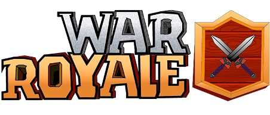

<p align="center">
  
</p>

<h1 align="center">War Royale</h1>

<p align="center">
  <a href="https://www.java.com">
    
  </a>
  <a href="https://github.com/hexstorm9/AgeRoyale/tree/develop/LICENSE">
    
  </a>
  <a href="https://github.com/hexstorm9/AgeRoyale/tree/develop">
    
  </a>
    <a href="https://opensource.org/licenses/BSD-3-Clause">
    
  </a>
</p>

<p align="center">
    War Royale is a Clash Royale inspired opensource game for Windows, Mac and Linux built with Java Swing.
</p>
<br>


## Trailer
[](https://www.youtube.com/watch?v=CX-SqW7LTcA)

## Features
- [x] Login and Register systems
- [x] 8 Different Cards
- [x] Player vs AI 
- [x] Multiple Arenas 
- [x] MySQL Database Interaction
- [x] Multiple Language Support (currently English, Spanish and Catalan)


## How To Use
```bash
# Clone this repository
$ git clone https://github.com/hexstorm9/AgeRoyale/tree/develop.git

# Set up a MySQL database with the script in resources/sql
# Adjust the database connection settings in resources/config.json
# The database can be hosted locally or remotely

# Run Main.java
```